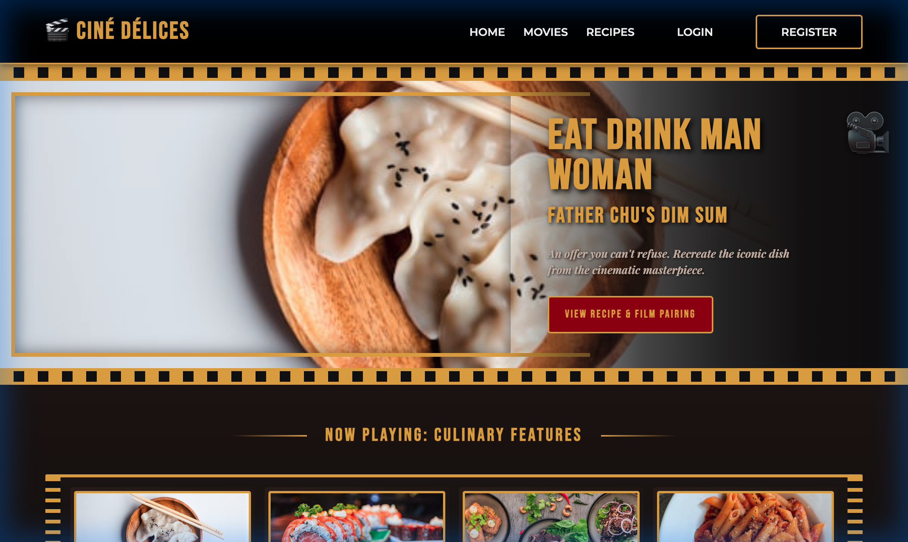
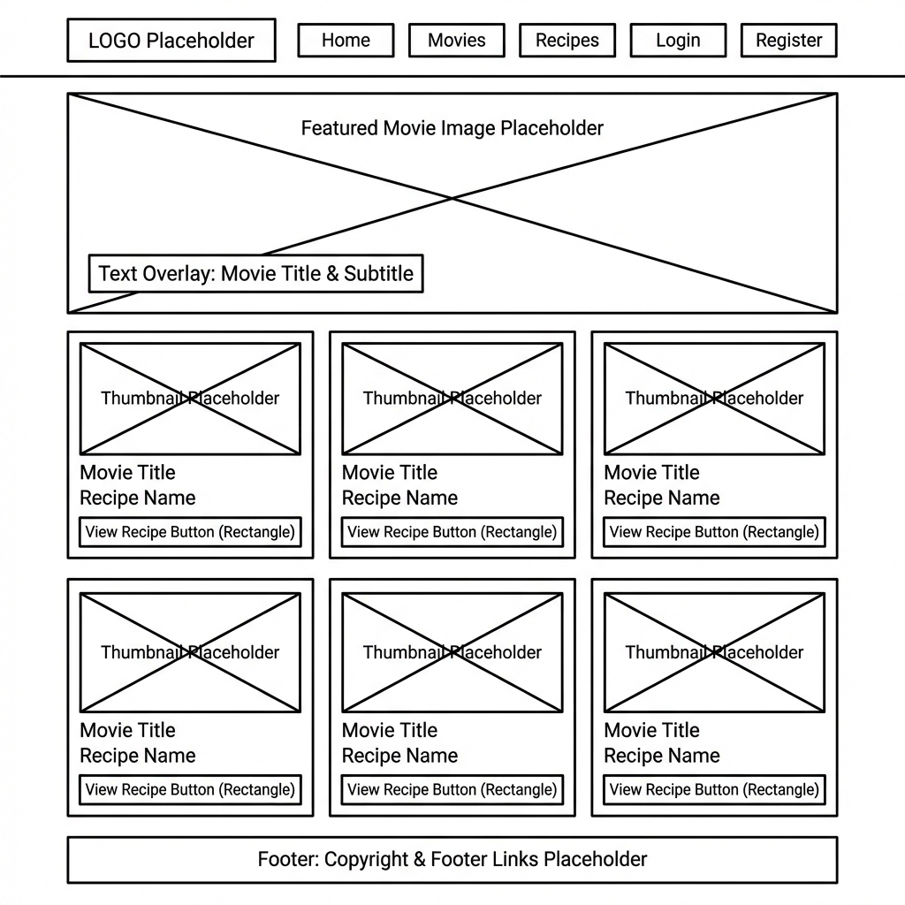
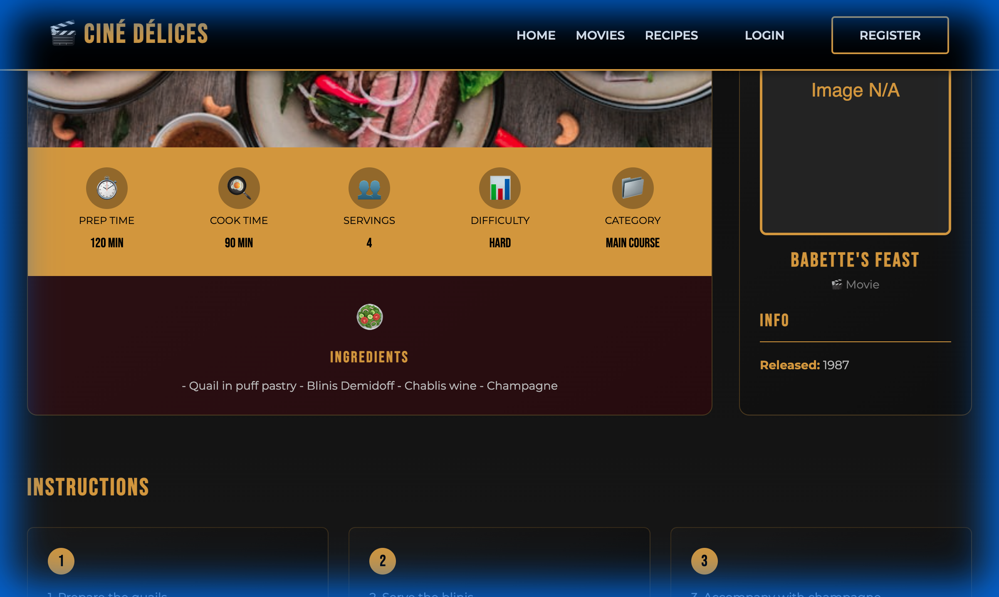
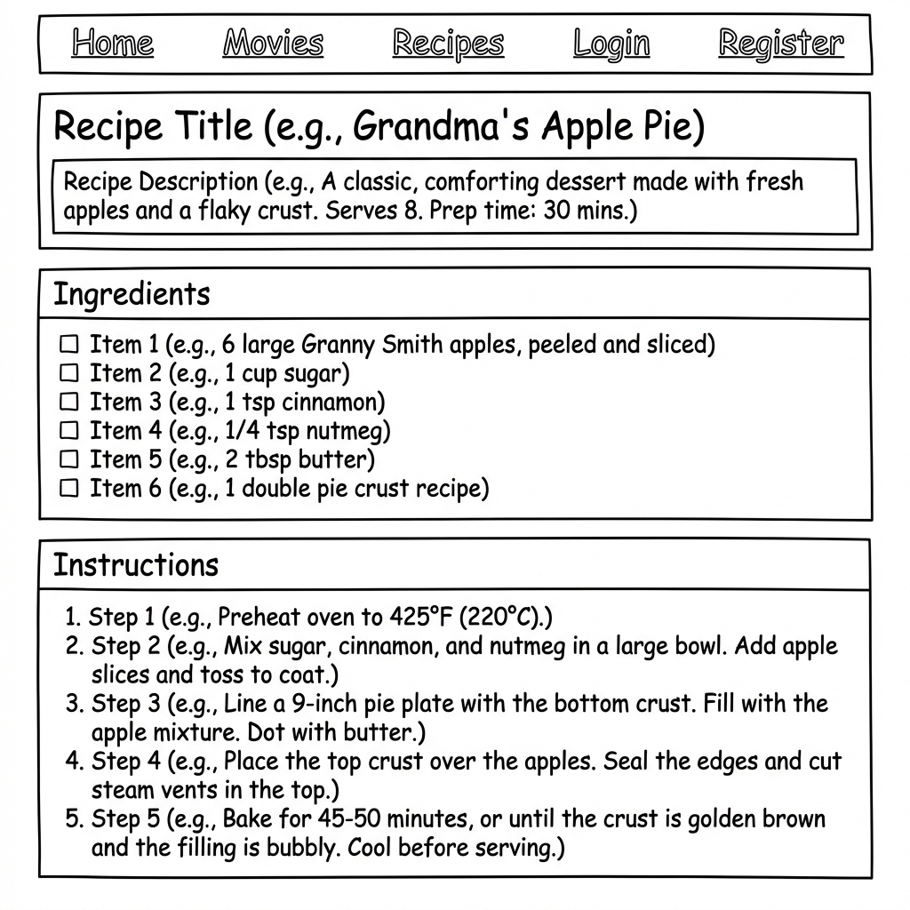
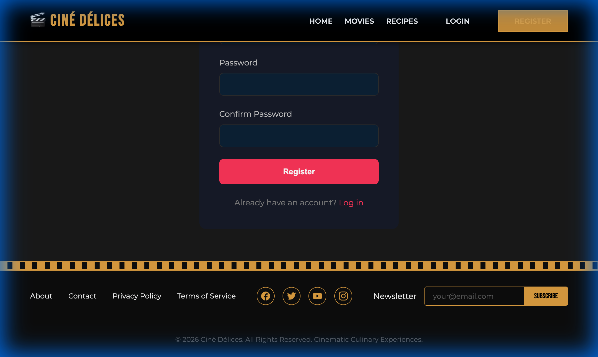
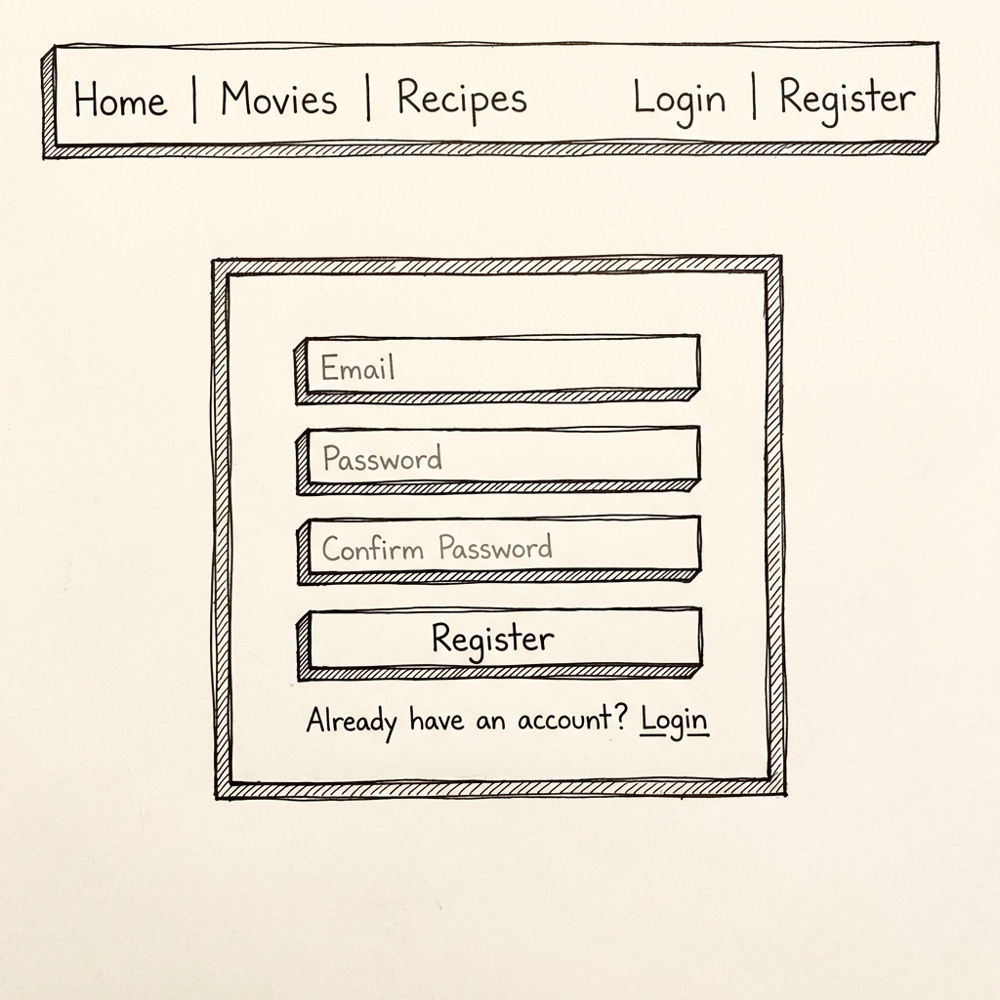

# Visual Documentation & Mockups

This document organizes the visual assets for the project, categorizing them into the current implementation state and future design concepts.

## 1. Current Implementation
These assets represent the application as it currently exists and runs in the development environment.

### User Journey Recording
A complete video walkthrough demonstrating the user flow from the Homepage to Recipe Details and Registration.
- **File**: [site_recording.webp](site_recording.webp)

### High-Fidelity Screenshots & Corresponding Wireframes
Static captures of key views paired with their schematic representations.

**1. Homepage**
| Current Implementation | Wireframe |
|:---:|:---:|
|  |  |
- **Description**: The main landing page featuring the hero section and a grid of movie-themed recipe cards.

**2. Recipe Details**
| Current Implementation | Wireframe |
|:---:|:---:|
|  |  |
- **Description**: The detail view for a specific recipe (e.g., "Babette's Feast"), showing ingredients, instructions, and metadata.

**3. Registration**
| Current Implementation | Wireframe |
|:---:|:---:|
|  |  |
- **Description**: The user sign-up form.

---

## 2. Conceptual Design
These assets represent proposed designs or wireframes for future iterations.

### High-Fidelity Wireframe
- **File**: [wireframe_mockup.png](wireframe_mockup.png)
- **Description**: A polished wireframe visualizing a potential future state or alternative design layout with a focus on dark mode aesthetics and simplified navigation.
