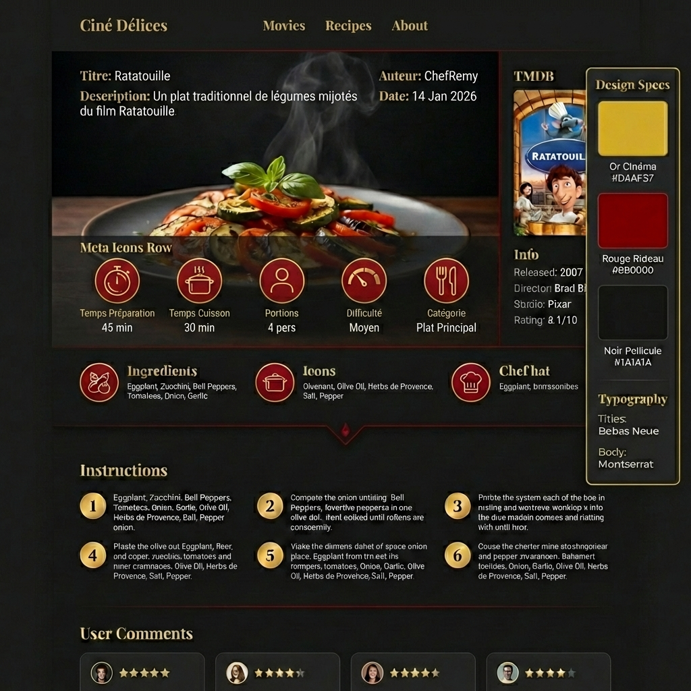
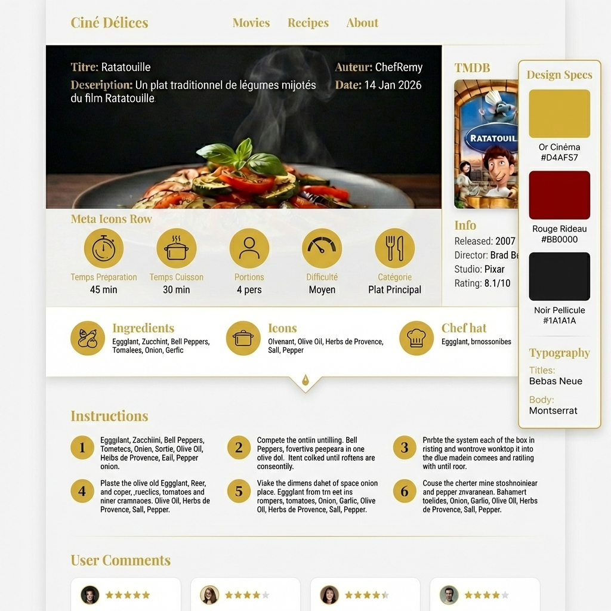

# Maquettes Haute-Fidélité - Ciné Délices (Corrigé V2)

Ce document présente les maquettes finales du projet, incluant la correction des versions "Mode Clair".

---

## 1. Page d'Accueil

### 1.1 Mode Sombre (Dark Mode)
*Version de référence - Ambiance Cinéma (Or & Rouge)*

### 1.2 Mode Clair (Light Mode)
*Version corrigée - Structure et boutons identiques au mode sombre, adaptés au fond clair.*

---

## 2. Page Recette

### 2.1 Mode Sombre (Dark Mode)
*Détail recette avec spécifications techniques visibles.*

### 2.2 Mode Clair (Light Mode)
*Version corrigée - Structure identique, fond Blanc Popcorn.*

---

*Document généré le 16 janvier 2026*
